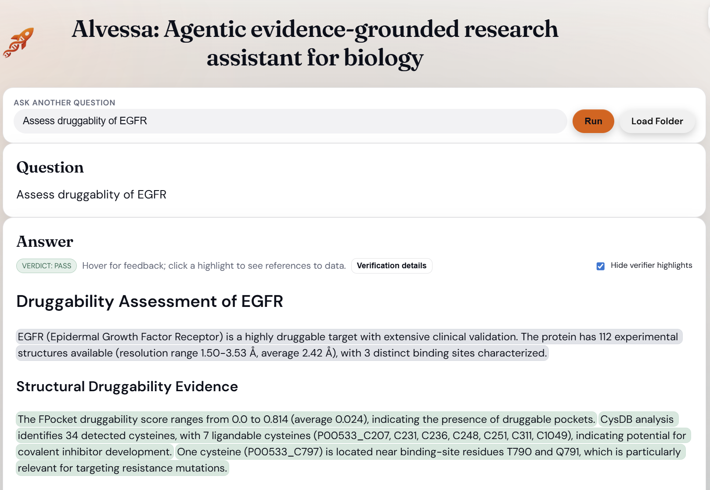
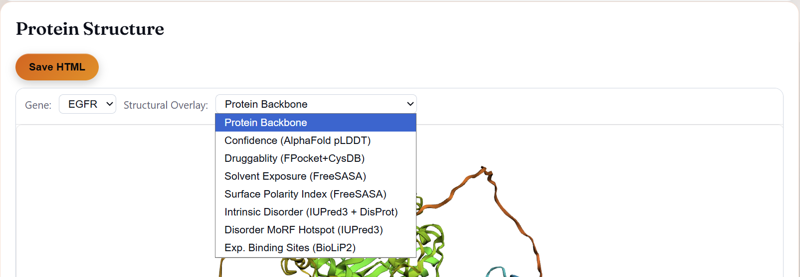
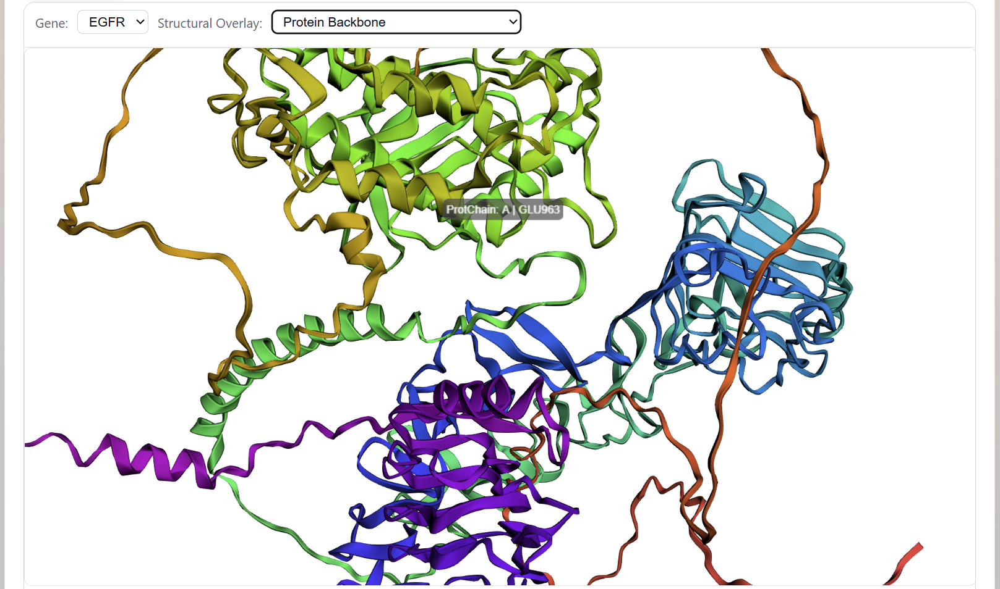
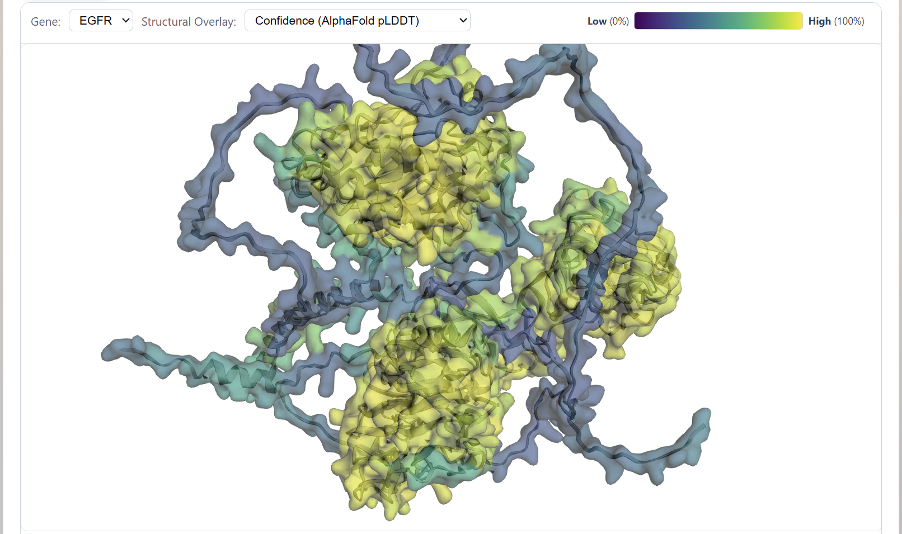
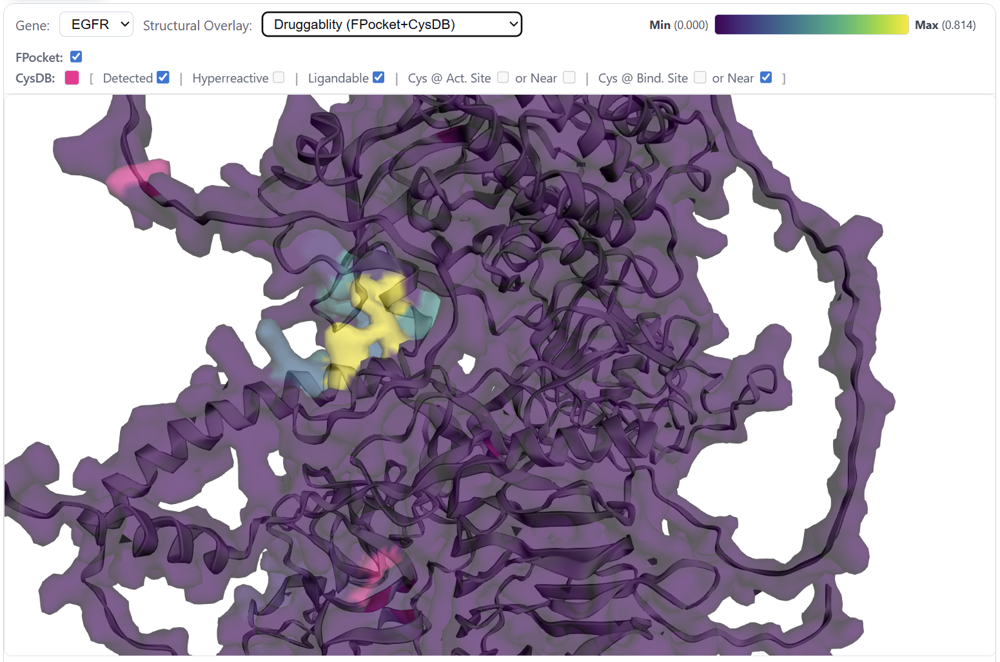
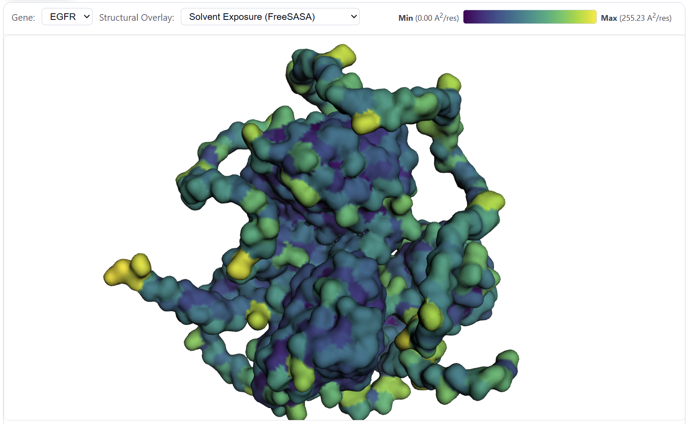
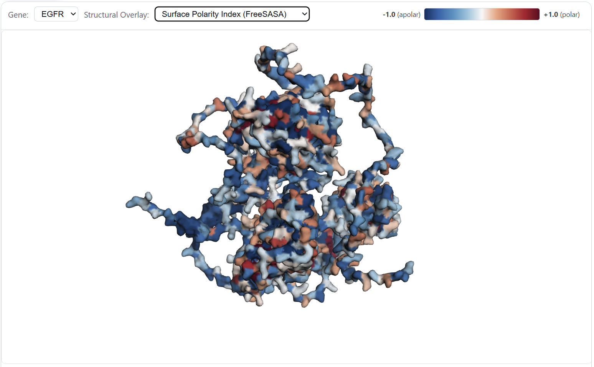
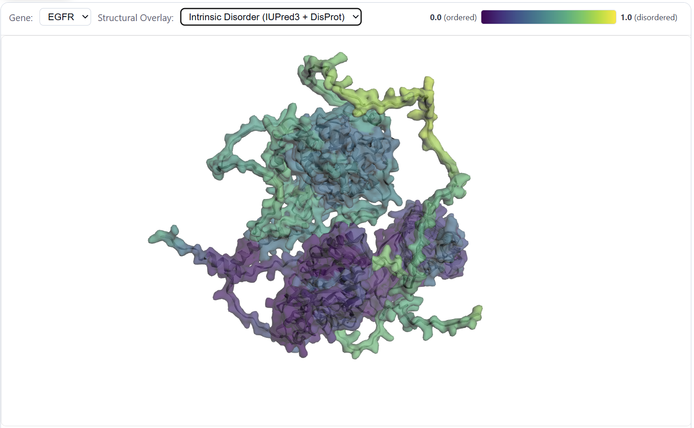
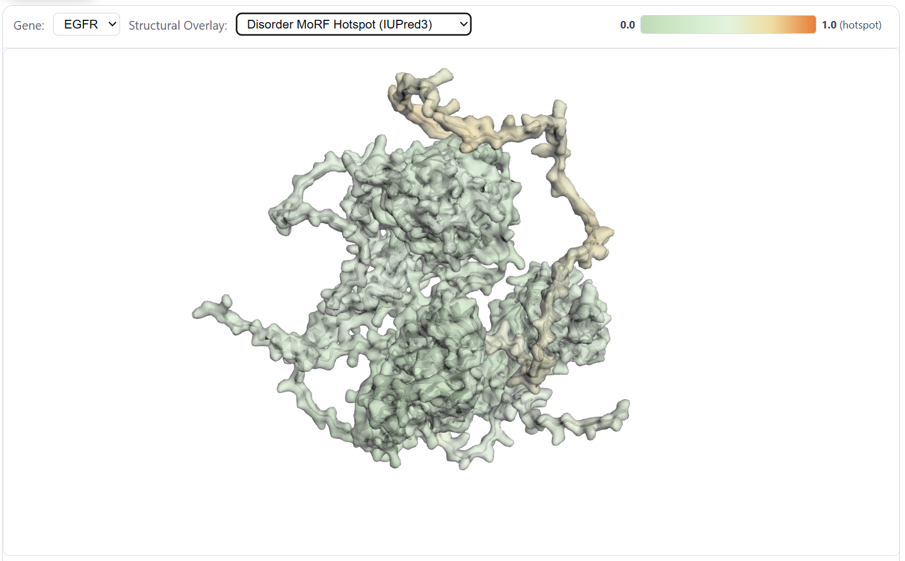
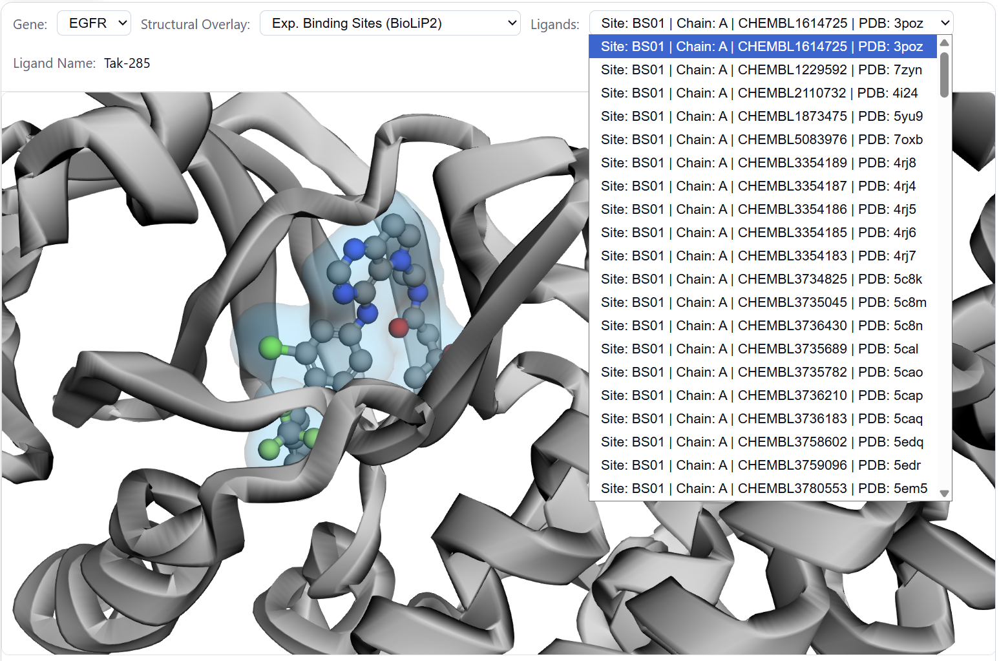

# Protein Tool Tutorial

This tutorial explains how to use and interpret the **Protein Tool** outputs in Alvessa. The Protein Tool integrates structure-based signals (AlphaFold), pocket-based druggability (FPocket), solvent exposure and polarity (FreeSASA), intrinsic disorder (IUPred3 + DisProt), MoRF propensity (ANCHOR2), and experimentally supported binding sites (BioLiP2). Where available, it also integrates cysteine chemoproteomics annotations (CysDB) aligned to UniProt residue numbering.

---

## Overview

The Protein Tool is a modular Alvessa component that:
- Loads protein structures from a local mirror of **AlphaFold DB v4**
- Adds residue-level tracks (confidence, pocket druggability, SASA, polarity, disorder, binding sites)
- Aggregates residue-level annotations into compact per-protein summaries
- Produces both a **text summary** and a **Protein Structure** visualization panel

---

## When the Protein Tool Is Used

The **Protein Tool is invoked automatically** if Alvessa determines it is relevant to the user’s question. Users do not need to explicitly select it.

### Example queries
- “Assess druggability of EGFR”
- “Analyze structural context of BRCA1”
- “Find ligandable cysteines in KEAP1”
- “Assess druggability of the protein with this amino acid sequence: PDLSAHNNHMAKVLTPELYAELRAKSTPSG"

You can request analysis for any gene using its gene symbol (Entrez/UniProt-resolved) or a complete or partial amino acid sequence of the protein (typically 16–32 amino acids is sufficient). If a query contains multiple genes, the Protein Tool processes each gene independently.

---

## Data Sources and Protein Inclusion Criteria

Proteins are included in the protein database only if they satisfy all of the following:
- A defined **Entrez gene symbol**
- A **UniProt accession**
- Precomputed **FPocket** and **FreeSASA** parameters
- A single AlphaFold fragment (**F1**, up to ~2,700 amino acids) in **AlphaFold DB v4**

This results in **16,339** unique protein entries. The Protein Tool then loads the corresponding structures from a partial local copy of AlphaFold DB.

---

## Where to Find Protein Tool Outputs in the UI

When the Protein Tool runs, you will typically see:

1. **Answer**  
   A text summary that includes interpretation notes, flags, and per-protein aggregated metrics. Similar to those provided on the figure below.

*Answer section*

---

## Protein Structure Panel

2. **Protein Structure**  
   An interactive 3D view of the AlphaFold structure with residue-level overlays. The **Protein Structure** panel shows the AlphaFold structure and supports overlaying different residue-level tracks.

### Controls

- **Gene:** dropdown  
  Appears when multiple genes were identified in the user query. Select which gene’s structure and tracks are currently shown.

- **Structural Overlay:** dropdown  
  Selects which feature track is visualized on the structure.

*Gene dropdown and Structural Overlay dropdown highlighted*

---

## Structural Overlay Options

Each overlay maps a residue-aligned vector onto the protein structure. The goal is to let you visually connect **local structure** with **functional evidence** and **biophysical context**.

Below we explain the meaning of each overlay and how to use it.

**Important tip:** For all overlays below, you can hover over any residue to display its chain and residue label (e.g., “ProtChain: A | GLU963”), making it easy to map visual features back to specific sequence positions.

---

### 1) Protein Backbone

Shows the raw protein structure without additional overlays.

**Use this view to:**
- Inspect overall fold and domain organization
- Orient the structure before applying overlays

*Protein Backbone Visualization*

---

### 2) Confidence (AlphaFold pLDDT)

The Protein Tool visualizes per-residue AlphaFold pLDDT scores using a continuous color gradient, allowing users to quickly assess structural confidence across the protein.

More detailed AlphaFold pLDDT confidence information per residue is provided in the protein’s text summary. The Protein Tool uses standard guidance:
- **> 90**: very reliable
- **70–90**: usually correct backbone
- **< 70**: often flexible/disordered

A low mean pLDDT flag appears in the summary when the average falls below 70.

**Use this view to:**
- Avoid over-interpreting predicted pockets in low-confidence regions
- Distinguish structured domains from flexible tails/loops

*Protein pLDDT Scores Visualization*

---

### 3) Druggability (FPocket + CysDB)

Displays per-residue **structural druggability** derived primarily from FPocket pocket predictions, with complementary chemoproteomics context from CysDB when available.

FPocket identifies and scores putative ligand-binding pockets based on geometric and physicochemical features of the protein structure. These pocket-level scores are converted into a residue-level signal that maps directly onto the AlphaFold model. In parallel, CysDB provides experimentally derived cysteine annotations, which are displayed as separate residue-level tracks and summaries. Interpreting FPocket and CysDB together enables identification of druggable regions that also contain experimentally observed detected, hyperreactive, or ligandable cysteines.

---

**FPocket vs CysDB: What’s the difference?**

- **FPocket** provides a *structure-based prediction* of druggable pockets, identifying regions of the protein that are geometrically and physicochemically favorable for small-molecule binding. It is purely computational and applies to any protein structure.
- **CysDB** provides *experimentally derived chemoproteomics evidence* focused specifically on cysteine residues. It reports whether individual cysteines have been detected, are hyperreactive, or are ligandable in competitive profiling experiments, and whether they are located at or near known active or binding sites.

Used together, FPocket highlights **where binding could occur**, while CysDB highlights **where binding has been experimentally observed or chemically validated**, enabling more informed prioritization of druggable sites.

---

**How residues are scored (FPocket):**
- Each residue is assigned the **mean druggability score** of all FPocket-predicted pockets that include it  
- Residues not covered by any pocket are filled with **0** (non-druggable) to keep the residue track continuous  
- For visualization, scores are normalized within each protein fragment to maximize the dynamic range of the color gradient  
- Raw minimum and maximum values are preserved for interpretation (e.g., min = 0.000, max = 0.814)

The generated text summary provides a quantitative assessment of overall protein druggability, integrating information from FPocket pocket predictions and CysDB cysteine annotations.

**Visualization Options**

FPocket druggability scores are shown using a green-to-yellow color gradient, where brighter colors indicate higher predicted druggability. CysDB cysteine annotations are shown in pink, providing clear visual contrast so experimentally supported cysteines remain easy to identify when overlaid on FPocket scores.

For CysDB, separate checkboxes allow you to visualize cysteine residues that are detected, hyperreactive, or ligandable, as well as cysteines located at or near active sites ("Cys @ Act. Site or Near") or at or near binding sites ("Cys @ Bind. Site or Near").

**Use this view to:**
- Identify high-scoring pocket regions and compare druggability across domains  
- Combine FPocket scores with pLDDT to focus on structurally confident, pocket-rich regions  
- Integrate pocket predictions with CysDB cysteine annotations to prioritize chemically tractable and experimentally supported sites  

*Per-residue FPocket druggability mapped onto the AlphaFold structure. CysDB cysteine annotations can be overlaid separately to highlight experimentally supported reactive or ligandable residues within predicted pockets.*

---

Displays the protein’s solvent-accessible surface, colored by per-residue total **SASA** (solvent-accessible surface area, reported in Ų per residue), precomputed using FreeSASA and stored in the local database.

**Interpretation:**
- Higher SASA indicates a more exposed residue  
- Lower SASA indicates a more buried residue  

Values are normalized for visualization, while raw summary statistics (minimum, maximum, and mean SASA) are available in the tool’s text summary output.

**Use this view to:**
- Determine whether predicted pockets or functional residues are solvent-exposed  
- Prioritize accessible residues for binding or reactivity hypotheses  

*Per-residue solvent-accessible surface area (SASA) mapped onto the protein structure.*

---

### 5) Surface Polarity Index (FreeSASA)

Displays a per-residue **surface polarity index** derived from the polar and apolar components of solvent-accessible surface area (SASA).

δᵢ = (Aₚ,ᵢ − Aₐ,ᵢ) / (Aₚ,ᵢ + Aₐ,ᵢ)

Where:
- **Aₚ,ᵢ**: polar SASA  
- **Aₐ,ᵢ**: apolar SASA  

**Scale:**
- **−1**: predominantly apolar exposure  
- **0**: balanced polar/apolar exposure (also used for buried or undefined residues)  
- **+1**: predominantly polar exposure  

If Aₚ,ᵢ + Aₐ,ᵢ = 0 (buried residues), or if values are missing, the polarity index is set to 0 to avoid division by zero and to keep the residue track continuous.

**Use this view to:**
- Identify hydrophobic versus polar surface patches  
- Add physicochemical context when evaluating pocket suitability  

*Per-residue surface polarity index mapped onto the protein structure.*

---

### 6) Intrinsic Disorder (IUPred3 + DisProt)

Displays a **consensus intrinsic disorder profile** that integrates sequence-based disorder predictions with curated experimental annotations.

The disorder signal reflects regions that are likely flexible or lack a stable three-dimensional structure under physiological conditions, which can influence binding mechanisms and druggability.

The consensus profile combines:
- IUPred3 disorder predictions (short and long modes)
- DisProt curated disordered regions

All scores are aligned to UniProt residue numbers and scaled to **[0, 1]**.

**Consensus construction:**
- The consensus disorder score is computed as the average of available IUPred3 short and long scores plus the DisProt contribution  
- DisProt contributes **1.0** inside curated disordered regions (or **0.5** if the annotation is ambiguous)  
- Missing residues default to **0.0**  
- Final values are clipped to the **[0, 1]** range  

**Use this view to:**
- Identify long disordered segments that may be difficult to target with structure-based approaches  
- Avoid over-interpreting FPocket or surface features in regions likely to be unstructured  

*Per-residue intrinsic disorder mapped onto the protein structure.*

---

### 7) Disorder MoRF Hotspot (ANCHOR2)

Displays **MoRF (Molecular Recognition Feature) propensity**, computed using ANCHOR2. MoRFs are short segments within intrinsically disordered regions that are predicted to remain flexible on their own but may adopt a defined structure when they interact with a binding partner.

This view highlights residues that are likely involved in **transient, regulation-driven interactions**, such as protein–protein contacts that do not rely on stable binding pockets.

**Definition:**
- MoRF propensity is computed as the per-residue maximum of ANCHOR2 short and long prediction scores  
- Missing values default to **0.0**  

**Use this view to:**
- Identify short disordered regions that may act as interaction hotspots  
- Interpret binding and regulatory potential in otherwise disordered regions  
- Complement FPocket analysis by revealing non-pocket-based interaction sites  

*Per-residue MoRF propensity mapped onto the protein structure.*

---

### 8) Exp. Binding Sites (BioLiP2)

Shows **experimentally supported ligand-binding residues** sourced from BioLiP2. These annotations are derived from curated structural interactions and include residue-level binding site definitions, functional descriptors, and literature references.

This overlay highlights regions of the protein that have been observed to bind ligands in experimentally determined structures, providing strong validation for predicted pockets and functional sites.

**Ligand selection and binding-site details**

When the BioLiP2 overlay is enabled, an additional **Ligand** dropdown menu becomes available. This dropdown lists all ligands with experimentally supported binding sites for the selected protein. For each ligand, the tool displays:
- **Binding Site ID** (e.g., `BS01`)  
- **Protein chain ID** (e.g., `A`)  
- **ChEMBL ID** of the ligand (e.g., `ChEMBL1614725`)  
- **Ligand name**, when available (e.g., `TAK-285`)  
- **Experimental PDB ID** associated with the binding site (e.g., `PDB: 3POZ`)  

When a ligand is selected, the corresponding **experimental PDB structure** is displayed below the AlphaFold model, with the ligand visually highlighted at its binding site. This allows direct comparison between predicted structural features and experimentally observed ligand binding.

**Use this view to:**
- Validate predicted pockets against experimental binding evidence  
- Distinguish known binding regions from purely computational hypotheses  
- Inspect ligand-protein interactions observed in solved structures  

*Experimentally supported BioLiP2 binding sites mapped onto the protein structure.*

---

## Recommended Workflow

A practical workflow for interpreting Protein Tool outputs:

1. **Start with pLDDT (structure confidence)**
   - Identify well-supported structured regions versus low-confidence or disordered regions.

2. **Inspect FPocket druggability**
   - Focus on pocket-rich regions that also have high pLDDT confidence.

3. **Integrate CysDB cysteine annotations**
   - Identify detected, hyperreactive, or ligandable cysteines and assess whether they co-localize with predicted pockets or functional regions.

4. **Check SASA and surface polarity**
   - Determine whether candidate regions and residues are solvent-exposed and chemically plausible for binding or reactivity.

5. **Overlay disorder and MoRF hotspots**
   - Identify flexible regions and potential transient interaction sites, and avoid over-interpreting stable pockets in highly disordered segments.

6. **Validate with BioLiP2**
   - Anchor predictions using experimentally observed ligand-binding sites when available.

This stepwise approach helps prioritize structurally confident, experimentally supported, and chemically tractable regions for downstream analysis.

---

## Notes and Common Pitfalls

- **Low pLDDT regions are tentative.** Structural features, pockets, and surface properties in low-confidence regions should be interpreted with caution.
- **FPocket scores are normalized per protein.** A “high” druggability score is meaningful within a single protein but is not directly comparable across different proteins unless raw score ranges are examined.
- **Disorder can obscure pocket signals.** Highly disordered regions often lack stable pockets and may appear non-druggable despite functional importance.
- **CysDB does not imply pocket-based druggability.** Ligandable or hyperreactive cysteines may occur outside classical pockets and should be interpreted in their local structural and solvent-exposure context.
- **Experimental binding sites provide the strongest validation.** When BioLiP2 binding sites are available, use them to anchor and validate computational predictions.

These considerations help avoid over-interpreting computational signals and support more reliable, structure-aware conclusions.

---

## Summary

The Protein Tool provides a unified, residue-level view of:
- **Structure confidence** (AlphaFold pLDDT)
- **Pocket-based druggability** (FPocket)
- **Cysteine chemoproteomics evidence** (CysDB)
- **Solvent exposure** and **surface polarity** (FreeSASA)
- **Intrinsic disorder** and **MoRF propensity** (IUPred3, DisProt, ANCHOR2)
- **Experimental binding sites** (BioLiP2)

Together, these overlays support structure-aware and chemistry-informed reasoning about where a protein is likely to be targetable, which residues are supported by experimental evidence, and which regions should be interpreted cautiously due to low confidence or intrinsic disorder.

**Note:** The Protein Tool is intended for research and hypothesis generation only and does not provide clinical or therapeutic recommendations.

---
