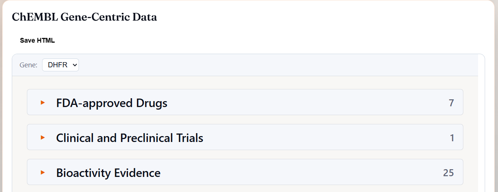
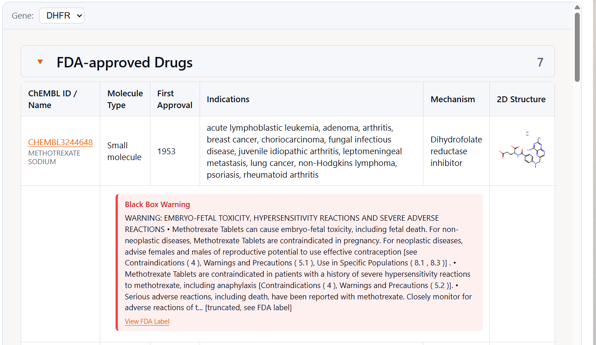
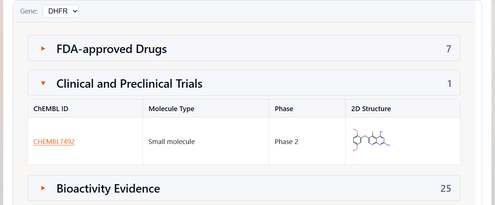
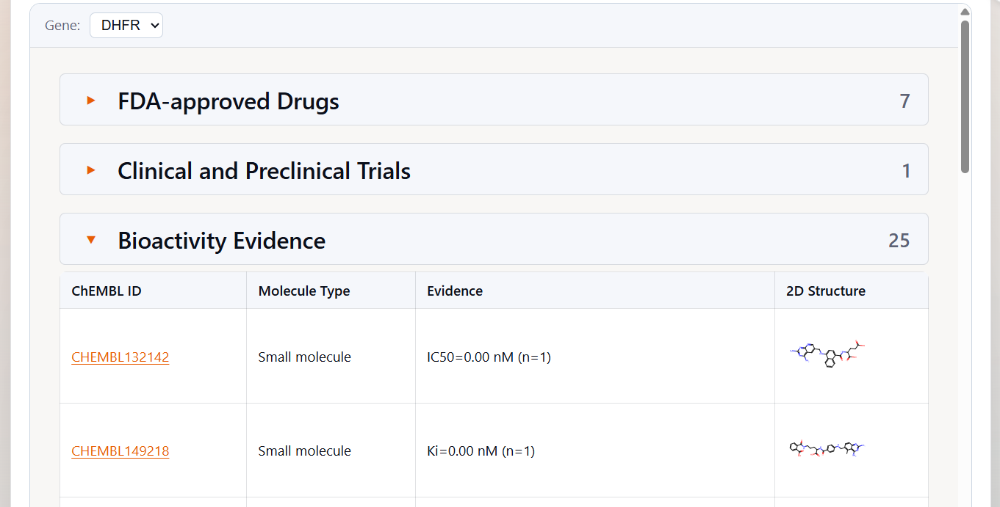

# ChEMBL Tool Tutorial

This tutorial explains how to use and interpret the **ChEMBL Tool** outputs in **Alvessa**.  
The ChEMBL Tool provides **evidence-grounded drug–target information** by integrating curated pharmacology data from a local **ChEMBL v35** database with FDA safety annotations and structured interpretation notes.

The tool connects **gene symbols → reviewed human UniProt targets → drugs, trials, mechanisms, safety, and bioactivity**, producing both a **concise text summary** and an **interactive table** suitable for downstream agents and human inspection.

---

## Overview

The ChEMBL Tool is a target-centric evidence module that:

- Resolves one or more **gene symbols** to **reviewed human UniProt accessions**
- Queries **ChEMBL** for:
  - FDA-approved drugs
  - Clinical and preclinical compounds
  - Mechanisms of action
  - Indications and development phase
  - Assay-level bioactivity
- Enriches results with:
  - FDA **boxed (“black box”) warnings**
  - Withdrawal and safety flags
- Produces:
  - A **compact text summary** for agent reasoning
  - An **interactive report** for detailed inspection

---

## When the ChEMBL Tool Is Used

The **ChEMBL Tool is invoked automatically** when Alvessa determines that drug–target evidence is relevant to the user’s question.  
Users do **not** need to explicitly select the tool.

### Example queries
- “Show FDA-approved drugs and clinical compounds for DHFR”
- “Are there any small-molecule inhibitors targeting KRAS?”
- “Which compounds interact with ACE or MEK1?”
- “Are there any compounds with measurable bioactivity against DHFR?”

If a query contains **multiple genes**, the ChEMBL Tool processes each gene independently and reports results per target.

---

## Where to Find ChEMBL Tool Outputs in the UI

When the ChEMBL Tool runs, you will typically see:

### 1) Question and Text Summary

*Question and text summary overview*

Example ChEMBL Tool invocation showing the user question and the generated text summary.  
The text summary provides a compact, agent-readable overview of drug–target evidence for the resolved gene(s), including counts of FDA-approved drugs, clinical and preclinical compounds, strongest reported bioactivity, mechanisms of action, and safety flags (e.g., boxed warnings). This summary is intended for rapid interpretation and downstream reasoning.

---

## ChEMBL Gene-Centric Panel

### 2) Gene-Centric Panel Overview

*ChEMBL gene-centric panel overview*

When multiple genes are detected in the user query, a **Gene selection dropdown** appears at the top of the panel, allowing users to switch between targets. For the selected gene, the panel is organized into three main sections:
- **FDA-Approved Drugs**
- **Clinical and Preclinical Compounds**
- **Bioactivity Evidence**

Each section presents a different layer of drug–target evidence while maintaining consistent compound identifiers and cross-links across panels.

---

## FDA-Approved Drugs

### 3) FDA-Approved Drugs Panel

*FDA-approved drugs targeting the selected gene panel*

For each FDA-approved drug targeting the selected gene, the panel displays:

- **ChEMBL ID** — a stable identifier used by ChEMBL to reference the compound across pharmacology, mechanism, and assay records
- **Drug name** — typically the generic (non-proprietary) name for approved drugs
- **Molecule type** — such as small molecule or antibody, indicating the general modality
- **First approval year** — indicates when the compound was first approved for therapeutic use.
- **Indications** — disease areas for which the drug is approved or has been investigated
- **Mechanism of action** — a curated description of how the compound modulates its target
- **2D chemical structure** — a schematic representation generated from the compound’s canonical SMILES
- At the bottom of the **Black Box Warning** section (if present), there is also a link labeled **“View FDA Label”**, which directs to **DailyMed** and provides access to the full, detailed FDA-approved drug label.

A direct link to **PubChem** is provided via the compound’s **InChIKey**, enabling external inspection of chemical properties and annotations.  
To follow the link, click on the compound’s **2D structure** to select it, then click on the **compound name** to open the corresponding PubChem page.

---

## Clinical and Preclinical Compounds

### 4) Clinical and Preclinical Trials Panel

*Clinical and preclinical compounds associated with the selected target*

This panel lists investigational compounds that have not yet reached FDA approval.  
For each compound, the table includes:

- **ChEMBL ID** (linked to the ChEMBL database)
- **Molecule type**
- **Clinical phase** (preclinical, Phase 1–3, when available)
- **2D chemical structure**

These entries help distinguish well-established targets from those that are actively being explored in discovery or clinical development.

---

## Bioactivity Evidence

### 5) Bioactivity Evidence Panel

*Assay-level bioactivity evidence for compounds targeting the selected gene*

This panel summarizes **assay-level bioactivity evidence** for compounds reported to interact with the selected target.  
For each compound, the strongest reported activity is displayed using:

- **ChEMBL ID**
- **Molecule type**
- **Potency evidence**, such as  
  *IC₅₀ = 0.01 nM (n = 2), pChEMBL = 10.82*
- **2D chemical structure**

Here:
- **IC₅₀** (half-maximal inhibitory concentration) is the concentration required to reduce target activity by 80% in an inhibition assay.
- **Kᵢ** (inhibition constant) reflects binding affinity derived from equilibrium measurements and is often considered less assay-dependent than IC₅₀.
- **EC₅₀** (half-maximal effective concentration) is the concentration required to achieve 50% of the maximal effect in activation or functional assays.
- **n** indicates the number of independent assay measurements supporting the reported value.

Only positive **IC₅₀**, **Kᵢ**, and **EC₅₀** measurements are included. Values are normalized to nanomolar (nM), and the most potent (lowest) value per measurement type is reported.

The **pChEMBL** value corresponds to the negative log₁₀ of the molar potency (e.g., IC₅₀, Kᵢ, or EC₅₀ expressed in molar units).  
It provides a standardized scale for comparing activity strength across assays, where higher pChEMBL values indicate stronger reported potency.

---

## Recommended Workflow

A practical workflow for interpreting ChEMBL Tool outputs:

1. **Start with FDA approvals**
   - Are there approved drugs targeting this gene?
   - What indications and mechanisms are represented?

2. **Inspect clinical and preclinical compounds**
   - Is there active development despite lack of approval?
   - How advanced are the clinical phases?

3. **Review bioactivity evidence**
   - Examine IC₅₀/Kᵢ/EC₅₀ values and pChEMBL
   - Assess whether potencies are consistent with tractable modulation

4. **Check safety signals**
   - Look for boxed warnings or withdrawn compounds
   - Interpret safety flags in context of indication and mechanism

5. **Integrate with other tools**
   - Combine ChEMBL evidence with Protein Tool structural context
   - Cross-reference pocket druggability, disorder, or cysteine reactivity

---

## Notes and Common Pitfalls

- **Absence of ChEMBL hits does not imply non-druggability.**  
  Some targets remain underexplored.
- **Potency values are assay-dependent.**  
  Strong biochemical activity does not guarantee cellular or in vivo efficacy.
- **Mechanism annotations may be incomplete.**  
  Not all compounds have curated mechanisms of action.
- **Safety warnings are contextual.**  
  Boxed warnings depend on dose, indication, and patient population.
- **Cross-target comparisons require caution.**  
  pChEMBL values are most meaningful within a single target context.

---

## Summary

The ChEMBL Tool provides a **gene-centric, evidence-grounded snapshot of druggability**, covering:

- FDA-approved drugs
- Clinical and preclinical compounds
- Mechanisms of action and indications
- Safety warnings and withdrawal flags
- Normalized assay-level bioactivity

By linking **gene symbols → UniProt targets → ChEMBL pharmacology → FDA safety labels**, the ChEMBL Tool supports structured, reproducible reasoning about whether and how a protein has been chemically modulated.

**Note:** The ChEMBL Tool is intended for **research and hypothesis generation only** and does not provide clinical, regulatory, or therapeutic recommendations.
