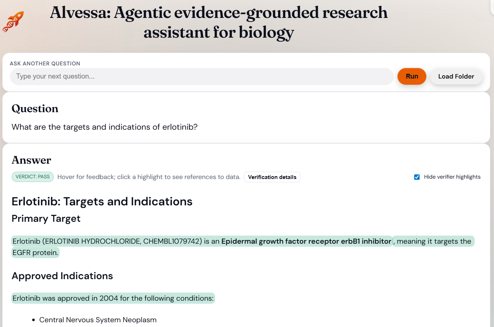
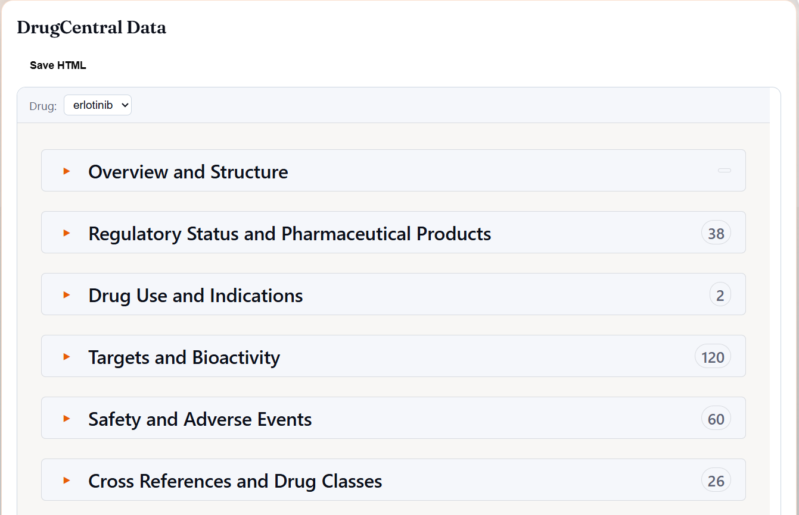
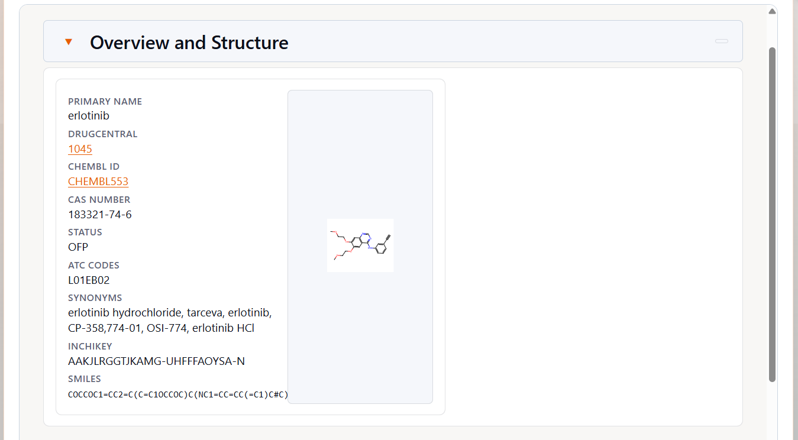
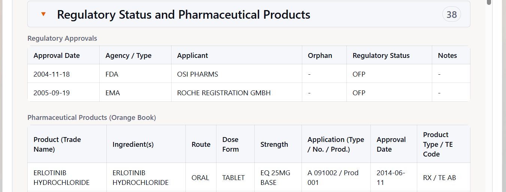
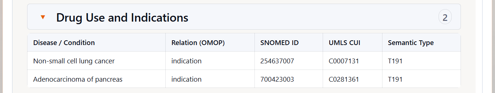
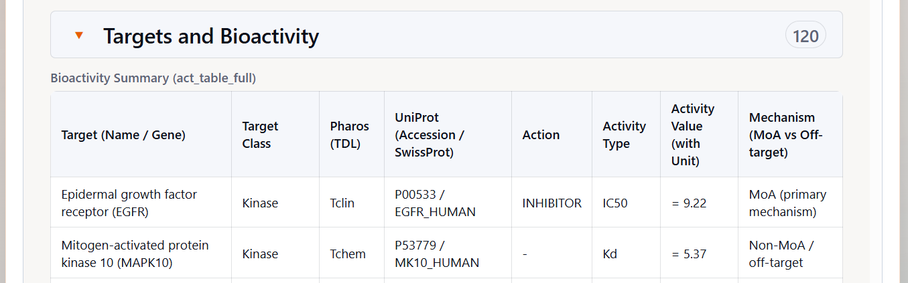
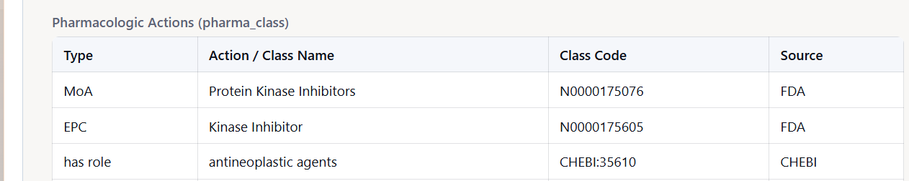
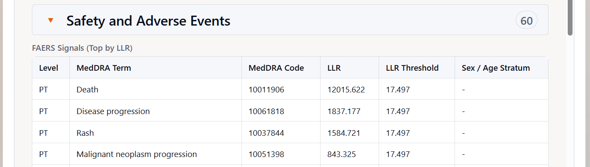
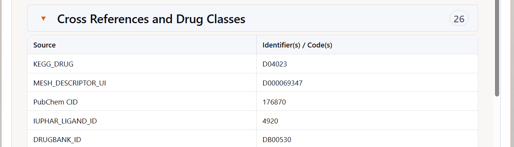

# DrugCentral Tool Tutorial

This tutorial explains how to use and interpret the **DrugCentral Tool** outputs in Alvessa.  
The DrugCentral Tool provides **drug-centric annotations** by querying a local snapshot of the DrugCentral database (v19) and retrieving chemical structure, regulatory status, molecular targets, indications, contraindications, pharmacologic actions, safety signals, and external cross-references into a compact, human-readable summary.

The tool is designed to support **research, interpretation, and hypothesis generation**, and to complement protein-centric and network-level analyses elsewhere in Alvessa.

---

## Overview

The DrugCentral Tool is a modular Alvessa component that:

- Resolves drug names and identifiers to **canonical DrugCentral records**
- Retrieves **layered drug evidence** from a local DrugCentral snapshot
- Aggregates chemical, regulatory, target, indication, and safety annotations
- Produces a concise **text summary** for each resolved drug
- Optionally renders an **interactive drug viewer** for deeper inspection

---

## When the DrugCentral Tool Is Used

The **DrugCentral Tool is invoked automatically** when Alvessa determines that a query is drug-centric or references one or more known drugs.

### Example queries
- “What are the targets and indications of erlotinib?”
- “Compare approved uses and safety signals of warfarin”
- "What are the indications of gefitinib?"

If multiple drugs are mentioned, each is processed independently.

---

## Where to Find DrugCentral Outputs in the UI

When the DrugCentral Tool runs, you will typically see:

### 1) Question and Text Summary

*Question and text summary overview*

This section provides a **compact narrative overview** of each resolved drug, summarizing its identity, regulatory context, major targets, indications, and key safety signals. It is intended as a fast, human-readable entry point before inspecting detailed tables.

---

## DrugCentral Data Panel

### 2) DrugCentral Data Panel Overview

*DrugCentral Data Panel Overview*

The DrugCentral Data Panel exposes structured drug annotations organized into the following sections:

- **Overview and Structure**
- **Regulatory Status and Pharmaceutical Products**
- **Drug Use and Indications**
- **Targets and Bioactivity**
- **Safety and Adverse Events**
- **Cross References and Drug Classes**

Each section corresponds to curated tables in the DrugCentral database and can be inspected independently.

---

## Overview and Structure

### 3) Overview and Structure Details

*Overview and Structure*

This section defines the **chemical and identifier core** of the drug, including:

- **Primary name** (e.g., *erlotinib*)
- **DrugCentral ID** (linked to the corresponding DrugCentral record)  
- **ChEMBL ID** (linked to the corresponding ChEMBL compound page)
- **CAS number**
- **Regulatory status flag**
- **ATC codes**
- **Synonyms and trade names**
- **InChIKey and SMILES**

**Use this section to:**
- Confirm the exact chemical entity being analyzed  
- Disambiguate salts, formulations, or closely related compounds  
- Anchor all downstream interpretation to the correct drug record  

---

## Regulatory Status and Pharmaceutical Products

### 4) Regulatory Status and Pharmaceutical Products

*Regulatory Status and Pharmaceutical Products*

This section summarizes regulatory and product-level information, including:

- **Regulatory approvals** (agency, approval date, orphan status, notes)
- **Orange Book pharmaceutical products**, when available:
  - Trade name
  - Active ingredient(s)
  - Route of administration
  - Dosage form and strength
  - Application number and approval date

**Use this section to:**
- Distinguish approved drugs from investigational compounds  
- Understand formulation and market context  
- Assess regulatory maturity and translational relevance  

---

## Drug Use and Indications

### 5) Drug Use and Indications

*Drug Use and Indications*

Lists therapeutic usage information, including:

- **Disease or condition**
- **Relation type** (OMOP vocabulary)
- **SNOMED ID**
- **UMLS CUI**
- **Semantic type**

**Use this section to:**
- Understand the therapeutic scope of the drug  
- Compare disease coverage across compounds  
- Identify potential repositioning hypotheses (with caution)  

---

## Targets and Bioactivity

### 6) Targets and Bioactivity

*Targets and Bioactivity: Bioactivity Summary*

*Targets and Bioactivity: Pharmacologic Actions*

This section connects the drug to **human gene-level targets** and quantitative activity data.

#### Bioactivity Summary
Includes:
- **Target name and gene symbol**
- **Target class**
- **Pharos Target Development Level (TDL)**
- **UniProt accession**
- **Action type** (e.g., inhibitor)
- **Activity type and value** (with units)
- **Mechanism annotation** (MoA vs off-target)

#### Pharmacologic Actions
Summarizes curated pharmacologic roles, such as:
- Inhibitor, agonist, antagonist
- Enzyme or receptor class membership
- Source database attribution

**Use this section to:**
- Link drugs to pathways and protein-centric analyses  
- Identify primary vs secondary targets  
- Support integration with the Protein Tool or network tools  

---

## Safety and Adverse Events

### 7) Safety and Adverse Events

*Safety and Adverse Events*

This section summarizes safety signals derived from **FAERS** and curated drug–drug interaction classes.

#### FAERS Signals (Top by LLR)

Each row reports an adverse event signal with a **Log Likelihood Ratio (LLR)**.

**What is LLR?**  
LLR (Log Likelihood Ratio) quantifies how strongly an adverse event is associated with a drug compared to background reporting rates.  
- Higher LLR → stronger statistical signal  
- LLR reflects **disproportionate reporting**, not causality or incidence  

Reported stratifications (e.g., sex or age) indicate the population subset in which the signal was detected.

**PT (Preferred Term)**

PT stands for **Preferred Term** in the **MedDRA (Medical Dictionary for Regulatory Activities)** hierarchy.  
A Preferred Term represents a **standardized clinical concept** used to describe an adverse event, sign, symptom, diagnosis, or medical condition reported in safety databases such as FAERS.

In the **FAERS Signals (Top by LLR)** table:

- **MedDRA Term (PT)** is the normalized adverse event label used for signal detection  
- Multiple synonymous or closely related clinical descriptions are mapped to a single PT  
- PTs enable consistent aggregation and comparison of adverse event reports across drugs

**Example:**
- Reported terms like *“skin rash”*, *“drug eruption”*, and *“maculopapular rash”* may map to a single MedDRA PT such as **Rash**

Using PT-level terms ensures that FAERS signals are:
- Comparable across datasets
- Less sensitive to free-text reporting variability
- Suitable for statistical signal detection (e.g., LLR calculation)

**Important note:**  
PTs indicate *reported adverse event concepts*, not confirmed diagnoses or causal relationships.

**Use this section to:**
- Flag drugs with known or emerging safety liabilities  
- Compare relative safety profiles across candidates  
- Inform early-stage filtering and prioritization  

---

## Cross References and Drug Classes

### 8) Cross References and Drug Classes

*Cross References and Drug Classes*

Lists mappings to external resources, including:

- **ATC classifications**
- **ChEMBL identifiers**
- **Drug class ontologies**
- Other curated identifier systems

**Use this section to:**
- Integrate DrugCentral data with external pharmacology resources  
- Maintain consistent identifiers across workflows  
- Support multi-database analyses  

---

## Recommended Workflow

A practical way to use the DrugCentral Tool:

1. **Confirm drug identity** using Overview and Structure  
2. **Review regulatory status** and pharmaceutical products  
3. **Inspect targets and bioactivity** for mechanistic context  
4. **Check indications and contraindications**  
5. **Evaluate safety signals and DDIs**  
6. **Integrate with protein, structure, or network analyses** in Alvessa  

---

## Notes and Common Pitfalls

- **Not a clinical decision tool.** No dosing or treatment recommendations are provided.
- **FAERS signals are observational.** They indicate reporting associations, not causality.
- **Target lists may be incomplete.** Absence of evidence is not evidence of absence.
- **Regulatory status can change.** Verify critical details against authoritative sources when needed.

---

## Summary

The DrugCentral Tool provides a **drug-centric, evidence-layered view** of:

- Chemical identity and structure  
- Regulatory status and products  
- Pharmacologic actions and human targets  
- Indications and contraindications  
- Safety signals and adverse events  
- External cross-references and drug classes  

Together, these outputs support **systematic, reproducible, and interpretable reasoning about drugs** within Alvessa.

**Note:** The DrugCentral Tool is intended for research and hypothesis generation only and does not provide clinical or therapeutic recommendations.
