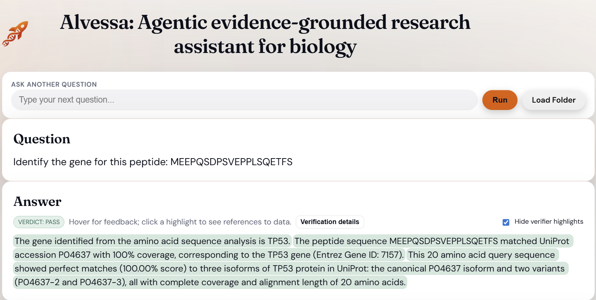
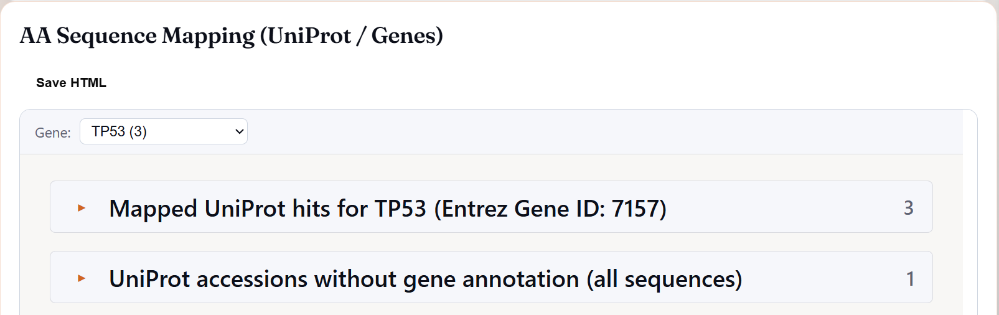
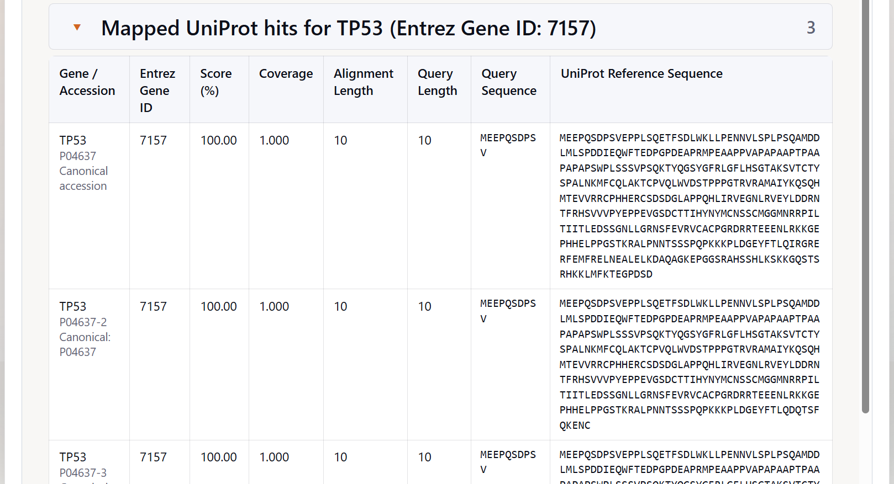
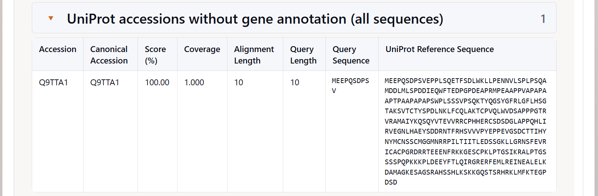

# Amino Acid Sequence–to–Gene Resolution Tool Tutorial

This tutorial explains how to use and interpret the **Amino Acid (AA) Sequence–to–Gene Resolution Tool** in **Alvessa**, using a concrete example to illustrate how peptide sequences are resolved to genes, UniProt accessions, and isoforms.

The tool maps short peptide fragments or full-length amino acid sequences to **gene-associated UniProt records** using a **local SQLite snapshot of UniProtKB**, without requiring internet access.

---
## When the AA Sequence Tool Is Used 

The **AA Sequence Tool is invoked automatically** when Alvessa detects that the user input contains **amino acid sequences** rather than gene symbols. Users do not need to explicitly select the tool.

---
## Underlying Database 

The resolver uses a **local SQLite snapshot of UniProtKB** that includes:

- Canonical and non-canonical UniProt accessions  
- Full protein amino acid sequences  
- Primary gene symbols  
- Optional Entrez Gene identifiers  

The database is constructed offline and reused across all Alvessa sessions, ensuring reproducibility and eliminating runtime dependency on external services.

---
### Example Queries

- “Identify the gene for this peptide: MEEPQSDPSVEPPLSQETFS”  
- “Which gene does this amino acid sequence correspond to? FGEVAKQEEFFNLSHCQLVTLISRDDLNVR”  
- “Identify the gene for this peptide: CAQYWPQKEEKEMIFEDTNL”  
- “Map this protein sequence to UniProt and gene information PQYRLEKQSEPNVAVDLDSTLESQSAWEFC”  
- “Resolve the following amino acid sequence to a human gene AAGGYDGQDQLNSVERYDVETETWTFVAPMKHRRSALGIT”  

If multiple sequences are provided in a single query, each sequence is processed independently.

---
## Example Question with Output

> **Identify the gene for this peptide:**  
> `MEEPQSDPSVEPPLSQETFS`

This is a **20–amino acid peptide** corresponding to the extreme N-terminus of a well-known human protein. Because peptides of this length may still be shared across multiple isoforms, this example illustrates how the tool reports **gene-level identity**, **canonical UniProt accessions**, and **isoform-level matches** together.

---
## Question and Text Summary Output

When the tool is triggered, Alvessa first displays a **text-based answer summary** that interprets the sequence resolution results at a high level.

*Question and text summary overview*

For this query, the summary reports:

- The peptide `MEEPQSDPSVEPPLSQETFS` maps to the **TP53** gene  
- **Gene:** TP53  
- **Entrez Gene ID:** 7157  
- **Canonical UniProt accession:** P04637  

The verification panel further reports that:

- The peptide aligns with **100.00% identity**
- The alignment length is **20 amino acids**, equal to the query length
- The sequence corresponds to the **N-terminal region** of the TP53 protein

The same peptide shows perfect matches to **three TP53 isoforms** in UniProt:

- **P04637** (canonical isoform)  
- **P04637-2** (isoform 2)  
- **P04637-3** (isoform 3)  

All matches show **complete coverage** and identical alignment length, indicating that the peptide is shared across these isoforms.

---
## AA Sequence Mapping (UniProt / Genes) Panel

To inspect the matches in detail, the **AA Sequence Mapping (UniProt / Genes) panel** provides a structured, tabular view of all resolved UniProt hits.

*AA Sequence Mapping panel overview*

This panel separates results into:

- **Gene-associated UniProt hits**
- **UniProt accessions without gene annotation**

---
## Mapped UniProt Hits for TP53

When **TP53 (Entrez Gene ID: 7157)** is selected, the panel displays all UniProt accessions associated with this gene that match the query sequence.

*Mapped UniProt hits for TP53*

In this example, the following entries are shown:

- **TP53 — P04637**  
  - Canonical accession  

- **TP53 — P04637-2**  
  - Canonical accession: P04637  

- **TP53 — P04637-3**  
  - Canonical accession: P04637  

Each row reports:

- Gene symbol  
- UniProt accession (canonical and isoform-specific)  
- Entrez Gene ID  
- Coverage  
- Alignment length  
- Query length  
- Query sequence  
- UniProt reference sequence  

These results indicate that the peptide sequence is **not isoform-specific**.  
Accordingly, the tool resolves the query confidently at the **gene level**, while retaining **isoform-level detail for transparency**.

---
## UniProt Accessions Without Gene Annotation

In addition to gene-associated hits, the panel may also display **UniProt accessions without gene annotation**.

*UniProt accessions without gene annotation*

In this example, one such entry is shown:

- **Accession:** Q9TTA1  
- **Canonical accession:** Q9TTA1  

This table includes:

- Accession and canonical accession  
- Similarity score  
- Coverage  
- Alignment length  
- Query length  
- Query sequence  
- UniProt reference sequence  

Entries in this section typically correspond to UniProt records that lack an assigned gene symbol or represent unreviewed or poorly annotated sequences. These hits are retained for **completeness and auditability**, but they are **not promoted to gene-level objects**.

---
## Interpretation for This Example

For the peptide `MEEPQSDPSVEPPLSQETFS`:

- The **gene identity is unambiguous**: **TP53**
- The peptide matches **UniProt P04637** with **100% identity and coverage**
- Multiple TP53 isoforms share the same N-terminal sequence
- Isoform-level resolution is **not possible or required** based on this peptide alone

Accordingly, the tool:

- Resolves the query to **TP53 at the gene level**
- Retains isoform matches for transparency
- Separates unannotated UniProt accessions

This behavior is expected for peptides derived from conserved protein regions.

---
## Key Takeaways

- Short and mid-length peptides may map to **multiple isoforms of the same gene**
- The AA Sequence Tool prioritizes **gene-level resolution**
- Canonical UniProt accessions are preferred when available
- Isoforms are retained to reflect biological reality
- Unannotated UniProt accessions are shown but not promoted

---
## Summary

Using the example peptide `MEEPQSDPSVEPPLSQETFS`, the Amino Acid Sequence–to–Gene Resolution Tool demonstrates how Alvessa:

- Resolves amino acid sequences to genes
- Handles canonical UniProt accessions and isoforms transparently
- Distinguishes gene-associated hits from unannotated UniProt records
- Produces clear, interpretable results suitable for downstream analysis

**Note:** This tool is intended for research and hypothesis generation only and does not provide clinical or diagnostic interpretations.
